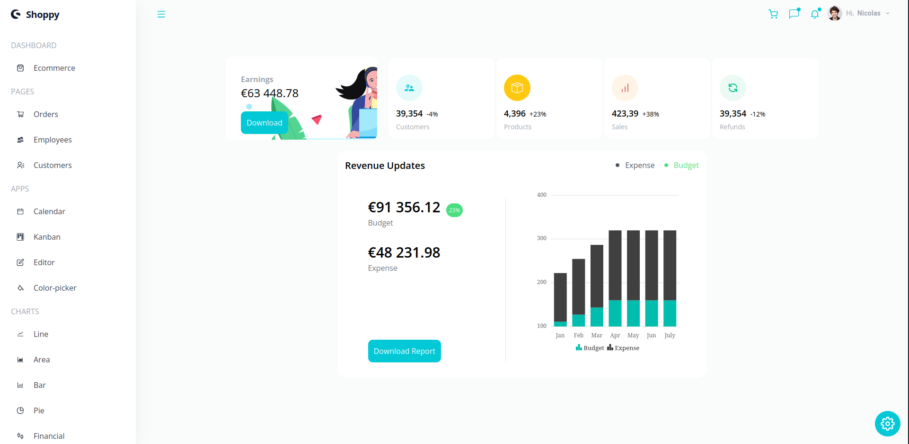

# React Admin Dashboard App With Theming, Tables, Charts, Calendar, Kanban and More
## Using the [Syncfusion](https://www.syncfusion.com/) library

Link to app: [https://admin-dasboard.netlify.app/](https://admin-dasboard.netlify.app/)

<br>



### Instructions
1. Clone the project with
```bash
git clone https://github.com/oxillix/react-admin-dashboard.git
```
2. Start the app with
```bash
npm start
```
3. (optional) create a production build with
```bash
npm start
```